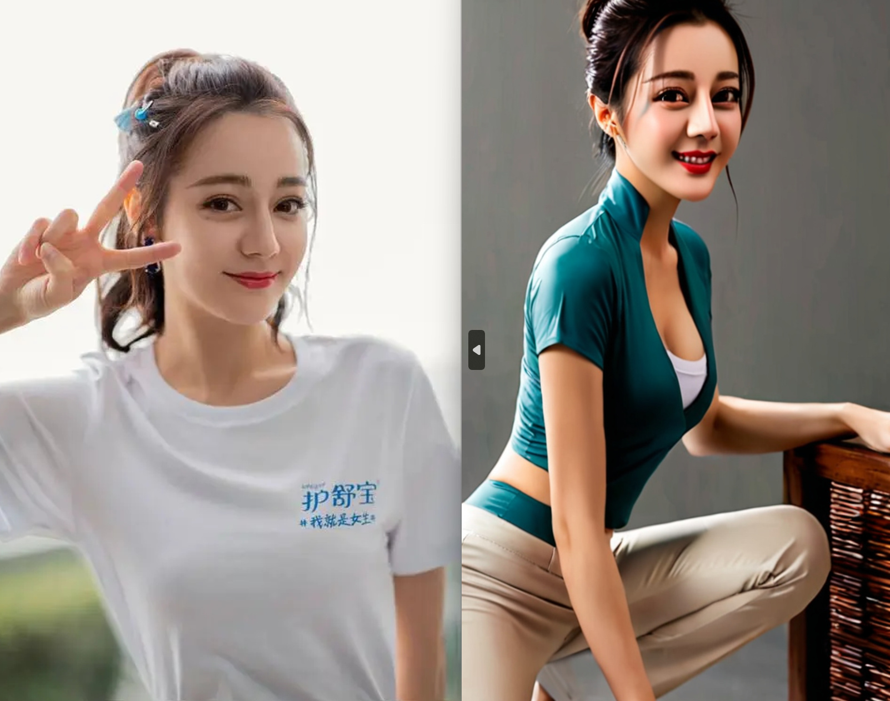
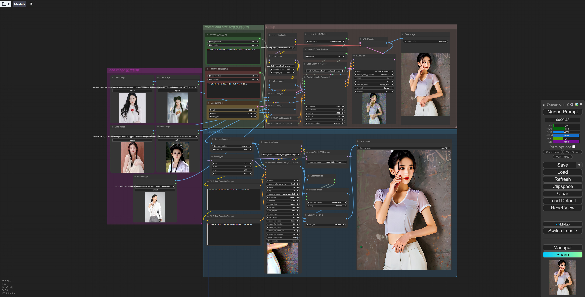

# Do anything with the face you want 使用你想要的脸做任何事

This workflow is based on InstandID: https://github.com/cubiq/ComfyUI_InstantID

You can load one to four images to provide the face,if you only have one photo,you can load four same images.You can load a image to control the position of the character's head in the bottom part of the purple group.

Input the positive and negative prompt and choose the size of image in the green group.You can use all langusge you want when inputing,this nodes can translate the text to English.

The workflow uses the SDXL model,of course you can also choose a suitable Lora to improve the quality of the image.

The blue group is used to improve the clarity of image,if you don't want this,you can just set the group nodes to never.

这个工作流依靠InstandID运行: https://github.com/cubiq/ComfyUI_InstantID

你可以加载一到四张图片来提供人脸，如果你只有一张照片，那么加载四张相同的图片。你可以在紫色组底部的位置加载图像以控制的角色头部位置

输入正负提示，并在绿色组中选择图像的大小。您可以在输入时使用您想要的所有语言，这些节点可以将文本翻译成英语。

工作流使用SDXL模型，您也可以选择合适的Lora模型来提高图像的质量。

蓝色组用于提高图像的清晰度，如果不需要，可以停用该组节点。

